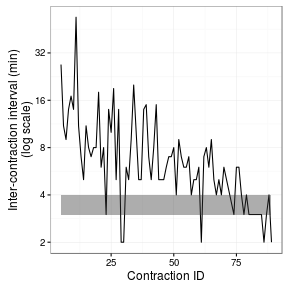

## The birth of Fern

On July 8, 2016 at 11:08pm, my daughter was born.  She is adorable.  Here she is on July 9.


## The contraction data

At about 6:15am on July 8, Fern's Mom started having contractions.  Our midwives said to call them once the contractions were consistently 3-4 minutes apart for at least one hour, and that the contractions themselves were between 45-90s in duration.  I started collecting data.

![Raw Data]

Here are the first (and last) six observations that I recorded.


| contractionID|startTime           | duration|
|-------------:|:-------------------|--------:|
|             1|2016-07-08 06:15:00 |       NA|
|             2|NA                  |       NA|
|             3|NA                  |       NA|
|             4|2016-07-08 08:04:00 |       NA|
|             5|2016-07-08 08:31:00 |      66S|
|             6|2016-07-08 08:42:00 |      20S|
|            84|2016-07-08 18:57:00 |      56S|
|            85|2016-07-08 19:00:00 |      59S|
|            86|2016-07-08 19:02:00 |      63S|
|            87|2016-07-08 19:05:00 |      50S|
|            88|2016-07-08 19:09:00 |       NA|
|            89|2016-07-08 19:11:00 |       NA|

Missing data are inevitable.

Of primary interest are the inter-contraction intervals.

```r
dat <- dat %>%
  mutate(interval = as.duration(startTime - lag(startTime)))
knitr:::kable(dat[5:10])
```


| contractionID|startTime           | duration|            interval|
|-------------:|:-------------------|--------:|-------------------:|
|             5|2016-07-08 08:31:00 |      66S| 1620s (~27 minutes)|
|             6|2016-07-08 08:42:00 |      20S|  660s (~11 minutes)|
|             7|2016-07-08 08:51:00 |      20S|   540s (~9 minutes)|
|             8|2016-07-08 09:05:00 |      25S|  840s (~14 minutes)|
|             9|2016-07-08 09:22:00 |      47S| 1020s (~17 minutes)|
|            10|2016-07-08 09:36:00 |      31S|  840s (~14 minutes)|

## Exploratory graphs


```r
intervalPlot <-
    dat %>%
    ggplot() + theme_bw() + 
    geom_line(aes(contractionID, as.numeric(interval) / 60)) +
    geom_ribbon(aes(x = contractionID, ymin = 3, ymax = 4),
                alpha = 0.4) +
    scale_x_continuous("Contraction ID") +
    scale_y_continuous("Inter-contraction interval (min)")
print(intervalPlot)
```

```
## Warning: Removed 4 rows containing missing values (geom_path).
```



The inter-contraction intervals are more variable and generally larger near the beginning of labour.  It looks like the intervals might converge on 3-4 minutes --- shown by the horizontal band --- just before we get ready to go to the hospital!  But what kind of model might determine such convergence?

## A model

$$ y = e^{\alpha} $$

